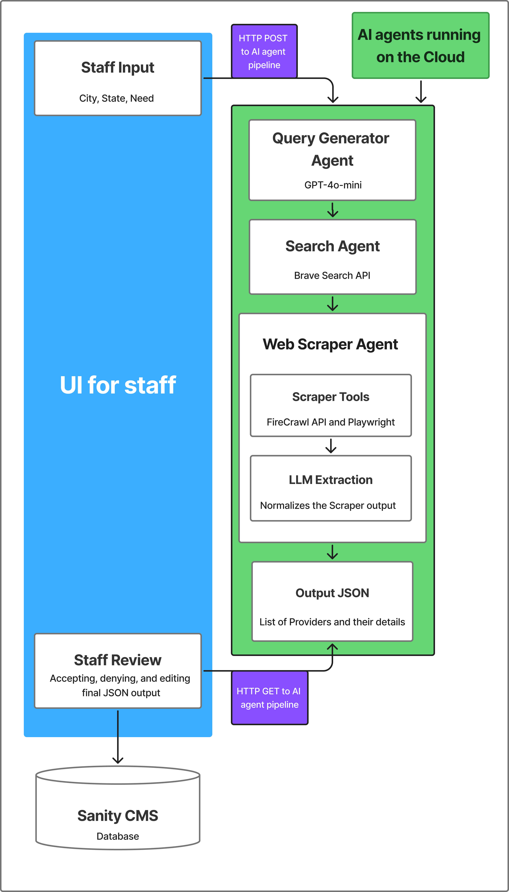
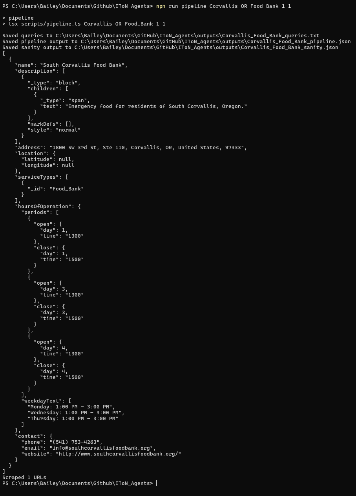

# In Time of Need — AI Agent Pipeline

**An AI-powered pipeline that automatically discovers, extracts, and normalizes local social service resources — food banks, shelters, and more — from across the web.**

[](https://nodejs.org/) [](https://www.typescriptlang.org/) [](https://github.com/ShreyBosamia/IToN_Agents/actions)

**[View GitHub](https://github.com/ShreyBosamia/IToN_Agents) · [Get Started](#getting-started) · [Report an Issue](https://github.com/ShreyBosamia/IToN_Agents/issues)**

---

## The Problem

Community resource directories — listing food banks, homeless shelters, addiction services, and other local aid — go stale fast. Organizations move, change hours, or shut down. Keeping that data accurate requires manual research across hundreds of websites, which is slow, expensive, and hard to scale.

**IToN Agents solves this by automating the entire discovery and extraction workflow**, turning a city, state, and resource category into structured, reviewable JSON data — ready to feed into a live resource directory.

---

## How It Works



_Staff submit a city, state, and resource category; AI agents in the cloud generate queries, search the web, scrape sites, and extract structured data; staff review and approve results before they publish to the Sanity CMS database._

1. **Query Generation** — an AI agent crafts 10 high-quality, city-specific search queries per resource category using few-shot prompting.
2. **Web Search** — queries are sent to the Brave Search API; results are deduplicated across all 10 queries.
3. **Scraping** — Playwright loads each URL with a real headless browser, handling JavaScript-heavy pages that simple HTTP requests would miss.
4. **Extraction** — a second AI agent reads each page and outputs structured JSON: organization name, address, hours, services, phone, and website.
5. **Human Review** — extracted data is staged in a job queue; a React UI lets staff approve or reject results before anything reaches production.

---

## Key Features

- **AI Query Generation** — generates exactly 10 optimized search queries per city/state/category, validated with automatic repair-retry if the output format is wrong.
- **Brave Search Integration** — searches all queries via the Brave Search API and deduplicates discovered URLs, maximizing coverage while minimizing redundant scraping.
- **JavaScript-Aware Scraping** — Playwright (headless Chromium) renders pages fully, extracting accurate content from modern, JS-heavy non-profit and government sites.
- **Structured Data Extraction** — `gpt-4o-mini` reads scraped content and outputs consistent JSON fields (name, address, hours, phone, services, website) across all resource types.
- **Human-in-the-Loop Approval** — an HTTP job server exposes a review API and a React frontend so staff can approve or deny pipeline output before it's published to the live directory.

---

## Demo & Sample Output



_Running `npm run pipeline -- "Corvallis" "OR" "Food_Bank" 1 1` — the pipeline generates queries, scrapes the web, and outputs a structured JSON record in seconds._

> See more examples in [`examples/Portland_Homeless_shelter_pipeline.json`](examples/Portland_Homeless_shelter_pipeline.json) and [`examples/Salem_FOOD_BANK_queries.txt`](examples/Salem_FOOD_BANK_queries.txt).

---

## Getting Started

**Requirements:** Node.js 18+, an [OpenAI API key](https://platform.openai.com/), and a [Brave Search API key](https://brave.com/search/api/).

```bash
# 1. Clone and install
git clone https://github.com/ShreyBosamia/IToN_Agents.git
cd IToN_Agents
npm install

# 2. Add your API keys
echo "OPENAI_API_KEY=your_key_here" >> .env
echo "BRAVE_SEARCH_API_KEY=your_key_here" >> .env

# 3. Run the full pipeline
npm run pipeline -- "Salem" "OR" "FOOD_BANK"
```

Output is written to `outputs/Salem_FOOD_BANK_pipeline.json`.

For full CLI reference, server setup, and development commands, see **[SETUP.md](SETUP.md)**.

---

## Contacts

| Name            | GitHub                                             |
| --------------- | -------------------------------------------------- |
| Bailey Bounnam  | [@BaileyBounnam](https://github.com/BaileyBounnam) |
| Adam Nguyen     | [@nguyenadamq](https://github.com/nguyenadamq)     |
| Shrey Bosamia   | [@ShreyBosamia](https://github.com/ShreyBosamia)   |
| Sungsoo Kim     | [@nalchamchi](https://github.com/nalchamchi)       |
| Sierra Sverdrup | [@N8tur3](https://github.com/N8tur3)               |

**Questions or feedback?** [Open an issue](https://github.com/ShreyBosamia/IToN_Agents/issues) on GitHub.

---
